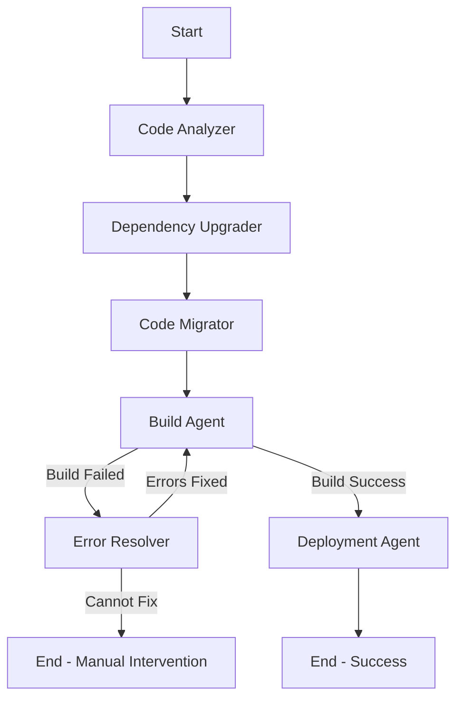

# Java Upgrade LangGraph Workflow

A comprehensive multi-agent system for automatically upgrading Java and Spring Boot applications using LangGraph orchestration with LiteLLM for externalized LLM configuration.

## Features

- **Multi-Agent Architecture**: Specialized agents for each phase of the upgrade process
- **LangGraph Orchestration**: Graph-based workflow with conditional routing and state management
- **LiteLLM Integration**: Externalized LLM configuration supporting multiple providers (OpenAI, Anthropic, Azure, Bedrock)
- **Automatic Error Resolution**: Intelligent error detection and fix generation
- **Maven Integration**: Full Maven build lifecycle support with multi-module project support
- **Git Integration**: Automatic branching, committing, and change tracking
- **Multi-Module Projects**: Full support for Maven parent-child modular projects with POM dependencies
- **Comparison Reports**: Detailed reports showing all file changes with diffs and agent tracking
- **Agent Tracking Comments**: Common tracking comments added to all modified files for auditability

## Architecture



### Agents

| Agent | Responsibility |
|-------|---------------|
| **Code Analyzer** | Analyzes codebase for upgrade requirements, deprecated APIs, and migration patterns |
| **Dependency Upgrader** | Upgrades pom.xml dependencies (Java version, Spring Boot, third-party libraries) |
| **Code Migrator** | Migrates source code (javax→jakarta, JUnit 4→5, Spring Security patterns) |
| **Build Agent** | Executes Maven builds and analyzes results |
| **Error Resolver** | Automatically resolves compilation and test errors |
| **Deployment Agent** | Prepares application for production deployment |

## Installation

```bash
# Clone the repository
git clone https://github.com/turja1981/acord.git
cd acord

# Install with pip
pip install -e .

# Or install with dependencies
pip install -e ".[dev]"
```

## Quick Start

### 1. Set up API Keys

```bash
# For OpenAI
export OPENAI_API_KEY=your-openai-key

# For Anthropic (optional)
export ANTHROPIC_API_KEY=your-anthropic-key

# For Azure OpenAI (optional)
export AZURE_API_KEY=your-azure-key
export AZURE_API_BASE=https://your-instance.openai.azure.com
```

### 2. Run the Upgrade

```bash
# Basic upgrade
java-upgrade ./my-java-project --java 21 --spring-boot 3.2.0

# With verbose output
java-upgrade ./my-java-project -j 21 -s 3.2.0 --verbose

# Dry run (analysis only)
java-upgrade ./my-java-project -j 21 -s 3.2.0 --dry-run

# Skip tests
java-upgrade ./my-java-project -j 21 -s 3.2.0 --no-tests
```

### 3. Analysis Only

```bash
# Just analyze without making changes
java-upgrade analyze ./my-java-project
```

## Configuration

### LiteLLM Configuration

Create a `litellm_config.yaml` file to customize LLM settings:

```yaml
# Default model for all agents
default_model: gpt-4-turbo

# Enable caching and cost tracking
enable_caching: true
enable_cost_tracking: true

# Model configurations
models:
  gpt-4-turbo:
    model_name: gpt-4-turbo-preview
    provider: openai
    api_key_env: OPENAI_API_KEY
    max_tokens: 4096
    temperature: 0.1
    fallback_models:
      - gpt-4
      - gpt-3.5-turbo

  claude-3-opus:
    model_name: claude-3-opus-20240229
    provider: anthropic
    api_key_env: ANTHROPIC_API_KEY
    max_tokens: 4096
    temperature: 0.1

# Assign specific models to agents
agent_models:
  code_analyzer: gpt-4-turbo
  code_migrator: claude-3-opus  # Claude excels at code transformation
  error_resolver: claude-3-opus
```

Generate a sample configuration:

```bash
java-upgrade init-config --output ./litellm_config.yaml
```

Use the configuration:

```bash
java-upgrade ./my-project --config ./litellm_config.yaml
```

### Environment Variables

| Variable | Description |
|----------|-------------|
| `OPENAI_API_KEY` | OpenAI API key |
| `ANTHROPIC_API_KEY` | Anthropic API key |
| `AZURE_API_KEY` | Azure OpenAI API key |
| `AZURE_API_BASE` | Azure OpenAI endpoint |
| `AWS_ACCESS_KEY_ID` | AWS credentials for Bedrock |
| `AWS_SECRET_ACCESS_KEY` | AWS credentials for Bedrock |

## Programmatic Usage

```python
from java_upgrade_workflow import JavaUpgradeWorkflow
from java_upgrade_workflow.config import LiteLLMConfig, Settings

# Create configurations
settings = Settings(
    project_path="./my-project",
    verbose=True,
)

llm_config = LiteLLMConfig.from_yaml("./litellm_config.yaml")

# Create and run workflow
workflow = JavaUpgradeWorkflow(settings=settings, llm_config=llm_config)

result = workflow.run(
    project_path="./my-project",
    target_java_version="21",
    target_spring_boot_version="3.2.0",
    run_tests=True,
)

# Check results
print(f"Status: {result.phase}")
print(f"Build successful: {result.build_successful}")
print(f"Files modified: {result.total_files_modified}")
print(f"Errors resolved: {result.total_errors_resolved}")
```

### Async Usage

```python
import asyncio
from java_upgrade_workflow import JavaUpgradeWorkflow

async def main():
    workflow = JavaUpgradeWorkflow()
    result = await workflow.run_async(
        project_path="./my-project",
        target_java_version="21",
        target_spring_boot_version="3.2.0",
    )
    print(result.get_summary())

asyncio.run(main())
```

## Supported Migrations

### Java Version Upgrades
- Java 8 → 11 → 17 → 21
- Automatic compiler plugin updates
- java.version property updates

### Spring Boot Upgrades
- Spring Boot 2.x → 3.x
- Jakarta EE namespace migration
- Spring Security configuration updates
- Property file migrations

### Code Migrations
| From | To |
|------|-----|
| `javax.persistence.*` | `jakarta.persistence.*` |
| `javax.servlet.*` | `jakarta.servlet.*` |
| `javax.validation.*` | `jakarta.validation.*` |
| `javax.annotation.*` | `jakarta.annotation.*` |
| `JUnit 4` | `JUnit 5` |
| `WebSecurityConfigurerAdapter` | `SecurityFilterChain` |
| `springfox` | `springdoc-openapi` |

## Multi-Module Project Support

The workflow fully supports Maven multi-module (parent-child) projects:

### Structure Detection

```bash
my-multi-module-project/
├── pom.xml              # Parent POM
├── common/
│   └── pom.xml          # Child module
├── api/
│   └── pom.xml          # Child module
├── service/
│   └── pom.xml          # Child module
└── web/
    └── pom.xml          # Child module
```

### Features

- **Automatic Detection**: Automatically detects multi-module structure from parent POM
- **Build Order Resolution**: Calculates correct build order based on inter-module dependencies
- **Shared Properties**: Updates properties in parent POM that are inherited by children
- **Module-Specific Changes**: Tracks changes per module for clear reporting
- **Dependency Management**: Handles dependencyManagement section in parent POM

### CLI Usage

```bash
# Multi-module project upgrade
java-upgrade ./my-multi-module-project --java 21 --spring-boot 3.2.0

# Build specific modules only
java-upgrade ./my-multi-module-project -j 21 -s 3.2.0 --modules api,service
```

### Programmatic Usage

```python
from java_upgrade_workflow import JavaUpgradeWorkflow

workflow = JavaUpgradeWorkflow()
result = workflow.run(
    project_path="./my-multi-module-project",
    target_java_version="21",
    target_spring_boot_version="3.2.0",
)

# Check module-specific results
for module_name, module_state in result.project_info.module_states.items():
    print(f"Module: {module_name}")
    print(f"  Build: {'OK' if module_state.build_successful else 'FAIL'}")
    print(f"  Changes: {len(module_state.code_changes)}")
```

## Comparison Reports

The workflow generates comprehensive comparison reports showing all changes made:

### Report Formats

Reports are generated in multiple formats:
- **Markdown** (`upgrade_report_TIMESTAMP.md`) - Human-readable with diffs
- **JSON** (`upgrade_report_TIMESTAMP.json`) - Machine-readable for integration
- **HTML** (`upgrade_report_TIMESTAMP.html`) - Styled HTML for web viewing

### Report Contents

```markdown
# Java Upgrade Comparison Report

## Project Information
- Project: my-application
- Multi-module: Yes (5 modules)

## Upgrade Summary
| Property | Before | After |
|----------|--------|-------|
| Java Version | 11 | 21 |
| Spring Boot | 2.7.0 | 3.2.0 |

## Change Statistics
| Metric | Count |
|--------|-------|
| Total Files Changed | 47 |
| Lines Added | +1,234 |
| Lines Removed | -567 |

## Changes by Agent
| Agent | Files Changed |
|-------|---------------|
| code_migrator | 32 |
| dependency_upgrader | 8 |
| error_resolver | 7 |

## Detailed File Changes
### 📝 `src/main/java/com/example/Service.java`
- **Type:** modified
- **Agent:** code_migrator
- **Description:** Migrated javax.persistence to jakarta.persistence

<details>
<summary>View Diff</summary>

```diff
- import javax.persistence.Entity;
+ import jakarta.persistence.Entity;
```
</details>
```

### Agent Tracking Comments

All modified files include tracking comments for auditability:

**Java/Kotlin files:**
```java
/*
 * ============================================================================
 * JAVA UPGRADE WORKFLOW - AUTOMATED MODIFICATION
 * ============================================================================
 * Agent: code_migrator v1.0.0
 * Timestamp: 2024-01-15T10:30:00
 * Change Type: migration
 * Description: Migrated javax.persistence to jakarta.persistence
 * Module: api
 * Correlation ID: 20240115103000-0001
 * ============================================================================
 */
```

**XML/POM files:**
```xml
<!--
  ============================================================================
  JAVA UPGRADE WORKFLOW - AUTOMATED MODIFICATION
  ============================================================================
  Agent: dependency_upgrader v1.0.0
  Timestamp: 2024-01-15T10:30:00
  Change Type: dependency_update
  Description: Upgraded Spring Boot to 3.2.0
  Module: parent
  Correlation ID: 20240115103000-0002
  ============================================================================
-->
```

### CLI Options for Reports

```bash
# Generate report to custom directory
java-upgrade ./my-project -j 21 -s 3.2.0 --report-dir ./reports

# Skip report generation
java-upgrade ./my-project -j 21 -s 3.2.0 --no-report
```

## Output

After a successful upgrade, the workflow generates:

1. **Comparison Reports** - Detailed reports in Markdown, JSON, and HTML formats
2. **UPGRADE_REPORT.md** - Summary report with deployment checklist
3. **Git commits** - All changes committed with descriptive messages
4. **Backup files** - Original files backed up as `.bak`

## Development

```bash
# Install dev dependencies
pip install -e ".[dev]"

# Run tests
pytest

# Run linting
ruff check src/

# Run type checking
mypy src/
```

## Project Structure

```
java-upgrade-workflow/
├── src/java_upgrade_workflow/
│   ├── agents/           # Specialized upgrade agents
│   │   ├── base_agent.py
│   │   ├── code_analyzer.py
│   │   ├── dependency_upgrader.py
│   │   ├── code_migrator.py
│   │   ├── build_agent.py
│   │   ├── error_resolver.py
│   │   └── deployment_agent.py
│   ├── config/           # Configuration management
│   │   ├── litellm_config.py
│   │   └── settings.py
│   ├── state/            # State management
│   │   └── upgrade_state.py
│   ├── tools/            # Agent tools
│   │   ├── maven_tools.py
│   │   ├── code_tools.py
│   │   └── git_tools.py
│   ├── utils/            # Utilities
│   │   └── logging.py
│   ├── workflow.py       # LangGraph workflow
│   └── cli.py            # CLI interface
├── config/               # Example configurations
├── tests/               # Test suite
└── pyproject.toml       # Project configuration
```

## Requirements

- Python 3.10+
- Maven 3.6+
- Java 8+ (source project)
- Git (optional, for change tracking)

## License

MIT License - see LICENSE file for details.

## Contributing

Contributions are welcome! Please read our contributing guidelines and submit pull requests.

## Support

For issues and feature requests, please use the GitHub issue tracker.
